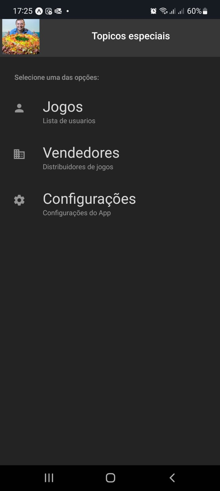

### Projeto Mobile com Navegação em React Native e UI com Native Paper

## Índice

- [1. Introdução](#1-introdução)
- [2. Pré Requisitos](#2-pré-requisitos)
- [3. Pacotes Necessários](#3-pacotes-necessários)
- [4. Inicializando o projeto](#4-inicializando-o-projeto)
- [5. Demo](#5-demo)
- [6. Screens](#6-screens)

---

### 1. Introdução

Este projeto utiliza o @react-navigation para disponibilizar a navegação no nosso App.

---

### 2. Pré Requisitos

Você deve ter algum conhecimento básico em `javascript`, `nodejs` e `ES6`.
Obrigatoriamente o **nodejs** deve estar instalado no seu sistema.

```
expo init nomeprojeto
cd nomeprojeto
```

---

### 3. Pacotes necessários

Serão necessários os seguintes pacotes, que poderão ser instalados via npm ou yarn.

```
yarn add @react-navigation/native
npx expo install react-native-screens react-native-safe-area-context
yarn add @react-navigation/stack
yarn add @react-navigation/bottom-tabs
yarn add react-native-paper
npx expo install react-native-gesture-handler
```

---

### 4. Inicializando o projeto

Para iniciar este projeto, utilizaremos o expo.

```
yarn ou npm i
expo start
```

### 5. Demo

Veja um demo da API REST rodando no Vercel
(https://backendmobile.vercel.app/api) ou acesse o código fonte: (https://github.com/fatecitu/backendMobile)

Para ver o projeto rodando através do Expo GO, aponte a sua câmera para o QR Code abaixo:


### 6. Screens

Veja algumas telas do projeto:

<p align="midle">
  
   
</p>

## Licença

[MIT](https://choosealicense.com/licenses/mit/)

Apoie o software livre! 🐧
# Topicos-Jogos-Frontend
